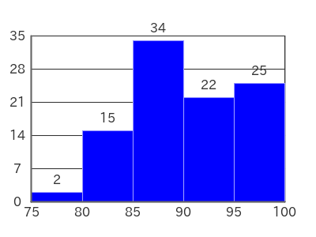

# PHP-Histogram

PHP-Histogram is easy to use for creating histograms.

　<br/>

## Installation

```bash
composer require macocci7/php-histogram
```

## Usage

### Most Simple Usage

- PHP

    ```php
    <?php
    require('../vendor/autoload.php');

    use Macocci7\PhpHistogram\Histogram;

    $hg = new Histogram();
    $hg->ft->setClassRange(5);
    $hg->ft->setData([0,5,8,10,12,13,15,16,17,18,19,20,24]);
    $hg->create('img/Histogram.png');
    ```

- Result: `img/Histogram.png`

    

## Lisence

[MIT](LICENSE)

*Document created: 2023/05/28*
*Document updated: 2023/05/28*

Copyright 2023 macocci7
