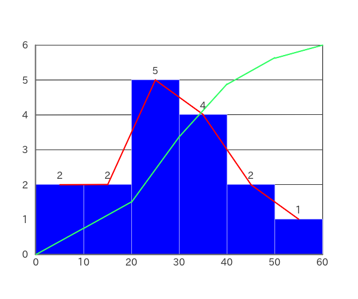
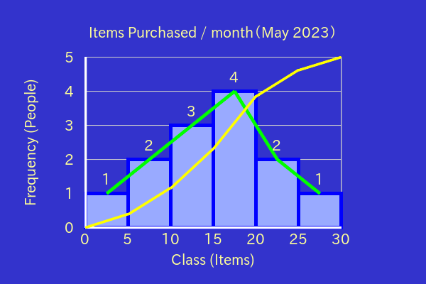
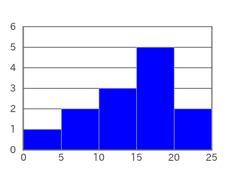

# PHP-Histogram

PHP-Histogram is easy to use for creating histograms.

　


## Contents

- [Installation](#installation)
- [Usage](#usage)
    - [Most Simple Usage](#most-simple-usage)
    - [Change Properties](#change-properties)
- [Examples](#examples)
- [License](#license)

## Installation

```bash
composer require macocci7/php-histogram
```

## Usage

### Most Simple Usage

- PHP

    ```php
    <?php
    require('../vendor/autoload.php');

    use Macocci7\PhpHistogram\Histogram;

    $hg = new Histogram();
    $hg->ft->setClassRange(5);
    $hg->ft->setData([0,5,8,10,12,13,15,16,17,18,19,20,24]);
    $hg->create('img/Histogram.png');
    ```

- Result: `img/Histogram.png`

    

### Change Properties

You can change properties of Histogram like as follows.

- PHP: [ChangeProperties.php](examples/ChangeProperties.php)

    ```php
    <?php
    require('../vendor/autoload.php');

    use Macocci7\PhpHistogram\Histogram;

    $hg = new Histogram();
    $hg->ft->setClassRange(5);
    $hg->ft->setData([1, 5, 6, 10, 12, 14, 15, 16, 17, 18, 20, 24, 25]);
    $hg->resize(600, 400) // Canvas Size: (width, height) / Deafult: (400, 300)
        ->frame(0.6, 0.6) // Ratio of the size of the plot area to the Canvas Size
        ->bgcolor('#3333cc') // only #rgb and #rrggbb formats are supported.
        ->axis(3, '#ffffff') // width in pix and color
        ->grid(1, '#cccccc') // width in pix and color
        ->color('#99aaff') // color of bars
        ->border(4, '#0000ff') // border of bars: width in pix and color
        ->fp(4, '#00ff00') // frequency polygon: width in pix and color
        ->crfp(3, '#ffff00') // cumulative relative frequency polygon

        // Note: Set the real path to the true type font (*.ttf) on your system.
        ->fontPath('/usr/share/fonts/truetype/ipafont-nonfree-uigothic/ipagui.ttf')
        ->fontSize(20)
        ->fontColor('#ffff99')
        ->barOn() // Histogram bars
        ->fpOn() // frequency polygon
        ->crfpOn() // cumulative frequency polygon
        ->frequencyOn() // frequency
        ->labelX('Class (Items)')
        ->labelY('Frequency (People)')
        ->caption('Items Purchased / month（May 2023）')
        ->create('img/ChangeProperties.png');
    ```

- Result: [ChangeProperties.png](examples/img/ChangeProperties.png)

    

## Examples

- [HistogramExample.php](examples/HistogramExample.php) >> results in:

    

- [HistogramExampleCase.php](examples/HistogramExampleCase.php) >> results in [HistogramExampleCase.md](examples/HistogramExampleCase.md)

- [OhtaniShoheiHistogram2023.php](examples/OhtaniShoheiHistogram2023.php) >> results in [OhtaniShoheiHistogram2023.md](examples/OhtaniShoheiHistogram2023.md)

- [PopulationInJapanHistogram2022.php](examples/PopulationInJapanHistogram2022.php) >> results in [PopulationInJapanHistogram2022.md](examples/PopulationInJapanHistogram2022.md)

## License

[MIT](LICENSE)

***

*Document created: 2023/05/28*

*Document updated: 2023/06/03*

Copyright 2023 macocci7
