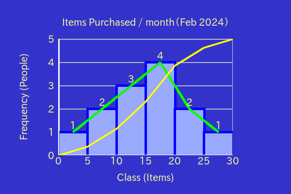

# PHP-Histogram

## 1. Features

`PHP-Histogram` is a PHP Library which is easy to use for creating histograms.

You can create a simple Histogram just by setting `class range` and `data` and `filepath` to save.


`Frequency Polygon`, `Cumulative Frequency Polygon`, `Cumulative Relative Frequency Polygon` and plotting `Frequency` are supported.


Changing other properties, such as `Caption`, `X Label`, `Y Label`, Various `Color`s, `Canvas Size`, `Frame Ratio` and Various `Width` are supported.



Transparent background is also supported.


## 2. Contents

- [1. Freatures](#1-features)
- 2\. Contents
- [3. Requirements](#3-requirements)
- [4. Installation](#4-installation)
- [5. Usage](#5-usage)
    - [5.1. Basic Usage](#51-basic-usage)
    - [5.2. Changing Properties By Methods](#52-changing-properties-by-methods)
    - [5.3. Changing Properties By Neon File](#53-changing-properties-by-neon-file)
    - [5.4. Changing Properties By Array](#54-changing-properties-by-array)
    - [5.5. Transparent Background](#55-transparent-background)
- [6. Examples](#6-examples)
- [7. License](#7-license)

## 3. Requirements

- PHP 8.1 or later
- Imagick PHP Extention
- Composer

## 4. Installation

```bash
composer require macocci7/php-histogram
```

## 5. Usage

### 5.1. Basic Usage

- PHP: [examples/BasicUsage.php](examples/BasicUsage.php)

    ```php
    <?php

    require_once __DIR__ . '/../vendor/autoload.php';

    use Macocci7\PhpHistogram\Histogram;

    $hg = new Histogram();
    $hg->setClassRange(5)
    ->setData([ 0, 5, 8, 10, 12, 13, 15, 16, 17, 18, 19, 20, 24, ])
    ->create('img/HistogramBasicUsage.png');
    ```

- Result:

    

- Details:
    - Import autoloader: `require_once __DIR__ . '/../vendor/autoload.php'`
    - Declare: `use Macocci7\PhpHistogram\Histogram`
    - Instantiate: `new Histogram()` or `new Histogram($width, $height)`
        - `$width`: canvas width, type of `int`, must be `50 <= $width`, `400`px as default.
        - `$height`: canvas height, type of `int`, must be `50 <= $height`, `300`px as default.
    - Set Class Range: `setClassRange($classRange)`
        - `$classRange`: type of positive `int|float`.
    - Set Data: `setData($data)`
        - `$data`: type of `array<int|string, int|float>`
    - Create: `create($path2Save)`
        - `$path2Save`: type of `string`.

### 5.2. Changing Properties By Methods

You can change properties of Histogram like as follows.

- PHP: [examples/ChangePropsByMethods.php](examples/ChangePropsByMethods.php)

    ```php
    <?php

    require_once __DIR__ . '/../vendor/autoload.php';

    use Macocci7\PhpHistogram\Histogram;

    // Initialization
    $hg = new Histogram();
    $hg->setClassRange(5)
        ->setData([1, 5, 6, 10, 12, 14, 15, 16, 17, 18, 20, 24, 25])

        // Changing Props By Methods

        // Canvas Size: ($width, $height) / Deafult: (400, 300)
        // 50 <= $width / 50 <= $height
        ->resize(600, 400)

        ->plotarea( // this takes precedence over 'frame()'
            offset: [120, 80],   // [x, y] in pix, default=[]
            width: 360, // width in pix, default=0
            height: 240, // height in pix, default=0
            backgroundColor: null, // null as transparent, default=null
        )

        // Ratio of the size of the plot area to the Canvas Size
        // frame($width, $height) / Default: (0.8, 0.7)
        // 0 < $width <= 1.0 / 0 < $height <= 1.0
        ->frame(0.6, 0.6)

        // Canvas Background Color
        // only #rgb and #rrggbb formats are supported.
        ->bgcolor('#3333cc')

        // Axis: width in pix and color
        ->axis(3, '#ffffff')

        // Grid: width in pix and color
        ->grid(1, '#cccccc')

        // Color of bars
        ->color('#99aaff')

        // Border of bars: width in pix and color
        ->border(4, '#0000ff')

        // Frequency Polygon: width in pix and color
        ->fp(4, '#00ff00')

        // Cumulative Relative Frequency Polygon
        ->crfp(3, '#ffff00')

        // Font Path
        // Note: Set the real path to the true type font (*.ttf)
        //       on your system.
        ->fontPath('/usr/share/fonts/opentype/ipafont-gothic/ipagp.ttf')

        // Font Size in pix
        ->fontSize(20)

        // Font Color
        ->fontColor('#ffff99')

        // Visibility of Histogram bars. barOff() is also available
        ->barOn()

        // Visibility of frequency polygon. fpOff() is also available
        ->fpOn()

        // Visibility of cumulative frequency polygon. crfpOff() is also available
        ->crfpOn()

        // Visibility of frequency. frequencyOff() is also available
        ->frequencyOn()

        // X Label
        ->labelX('Class (Items)')

        // Y Label
        ->labelY('Frequency (People)')

        // Caption
        ->caption('Items Purchased / month（Feb 2024）')

        // Save
        ->create('img/ChangePropsByMethods.png');
    ```

- Result: [examples/img/ChangePropsByMethods.png](examples/img/ChangePropsByMethods.png)

    

### 5.3. Changing Properties By Neon File

You can change properties of Histogram like as follows.

First, create a Neon file.

- Neon File: [examples/ChangePropsByNeon.neon](examples/ChangePropsByNeon.neon)

    ```neon
    canvasWidth: 600
    canvasHeight: 400
    canvasBackgroundColor: '#223399'
    plotarea:
        backgroundColor:    # `null` as transparent
    frameXRatio: 0.7
    frameYRatio: 0.6
    axisColor: '#999'
    axisWidth: 3
    gridColor: '#eee'
    gridWidth: 1
    gridHeightPitch: 1
    barBackgroundColor: '#ffcc33'
    barBorderColor: '#ff6600'
    barBorderWidth: 2
    frequencyPolygonColor: '#33cc00'
    frequencyPolygonWidth: 3
    cumulativeRelativeFrequencyPolygonColor: '#ff00ff'
    cumulativeRelativeFrequencyPolygonWidth: 7
    fontPath: 'fonts/ipaexm.ttf'
    fontSize: 24
    fontColor: '#eeeeee'
    showBar: true
    showFrequencyPolygon: true
    showCumulativeRelativeFrequencyPolygon: true
    showFrequency: true
    labelX: 'Class (Items)'
    labelXOffsetX: 0
    labelXOffsetY: 0
    labelY: 'Frequency (People)'
    labelYOffsetX: 0
    labelYOffsetY: 0
    caption: 'Items Purchased / month（Feb 2024）'
    captionOffsetX: 0
    captionOffsetY: 0
    ```

Second, Code PHP as follows.

- PHP: [examples/ChangePropsByNeon.php](examples/ChangePropsByNeon.php)

    ```php
    <?php

    require_once __DIR__ . '/../vendor/autoload.php';

    use Macocci7\PhpHistogram\Histogram;

    $hg = new Histogram();
    $hg->setClassRange(5)
       ->setData([1, 5, 6, 10, 12, 14, 15, 16, 17, 18, 20, 24, 25])
       ->config('ChangePropsByNeon.neon')
       ->create('img/ChangePropsByNeon.png');
    ```

Then, run the PHP code and view the result.

- Result: [examples/img/ChangePropsByNeon.png](examples/img/ChangePropsByNeon.png)

    

### 5.4. Changing Properties By Array

You can change properties of Histogram like as follows.

- PHP:

    ```php
    <?php

    require_once __DIR__ . '/../vendor/autoload.php';

    use Macocci7\PhpHistogram\Histogram;

    $props = [
        'canvasWidth' => 600,
        'canvasHeight' => 400,
        'canvasBackgroundColor' => '#224499',
        'plotarea' => [
            'offset' => [90, 80],
            'width' => 420, // 'width' takes precedence over 'frameXRatio'
            'height' => 240, // 'height' takes precedence over 'frameYRatio'
            'backgroundColor' => null,
        ],
        'frameXRatio' => 0.8,
        'frameYRatio' => 0.7,
        'axisColor' => '#999',
        'axisWidth' => 3,
        'gridColor' => '#eee',
        'gridWidth' => 1,
        'gridHeightPitch' => 1,
        'barBackgroundColor' => '#ffcc66',
        'barBorderColor' => '#ff6600',
        'barBorderWidth' => 2,
        'frequencyPolygonColor' => '#33cc00',
        'frequencyPolygonWidth' => 3,
        'cumulativeRelativeFrequencyPolygonColor' => '#ff5577',
        'cumulativeRelativeFrequencyPolygonWidth' => 7,
        'fontPath' => 'fonts/ipaexg.ttf',
        'fontSize' => 24,
        'fontColor' => '#eeeeee',
        'showBar' => true,
        'showFrequencyPolygon' => true,
        'showCumulativeRelativeFrequencyPolygon' => true,
        'showFrequency' => true,
        'labelX' => 'Class (Items)',
        'labelXOffsetX' => 0,
        'labelXOffsetY' => 0,
        'labelY' => 'Frequency (People)',
        'labelYOffsetX' => 0,
        'labelYOffsetY' => 0,
        'caption' => 'Items Purchased / month（Feb 2024）',
        'captionOffsetX' => 0,
        'captionOffsetY' => 0,
    ];

    $hg = new Histogram();
    $hg->setClassRange(5)
       ->setData([1, 5, 6, 10, 12, 14, 15, 16, 17, 18, 20, 24, 25])
       ->config($props)
       ->create('img/ChangePropsByArray.png');
    ```

- Result: [examples/img/ChangePropsByArray.png](examples/img/ChangePropsByArray.png)

    

### 5.5. Transparent Background

Setting colors to transparent is supported.

For example,

- PHP: [examples/TransparentBackground.php](examples/TransparentBackground.php)

    ```php
    <?php

    require_once __DIR__ . '/../vendor/autoload.php';

    use Macocci7\PhpHistogram\Histogram;

    $hg = new Histogram();
    $hg->config([
            'canvasBackgroundColor' => null,
            'barBackgroundColor' => '#ccccff',
            'barBorderColor' => '#0000ff',
            'barBorderWidth' => 2,
            'gridColor' => '#cc6666',
            'gridWidth' => 1,
            'axisColor' => '#aa6633',
            'fontColor' => '#882222',
            'caption' => 'Transparent Background',
       ])
       ->setClassRange(5)
       ->setData([ 1, 5, 8, 10, 11, 14, 16, 19, 20, ])
       ->create('img/TransparentBackground.png');
    ```

- Result: [examples/img/TransparentBackground.png](examples/img/TransparentBackground.png)

    

    Check if the image has transparent background with HTML:

    [examples/TransparentBackground.html](examples/TransparentBackground.html)

## 6. Examples

- [BasicUsage.php](examples/BasicUsage.php) >> results in:

    

- [ChangePropsByMethods.php](examples/ChangePropsByMethods.php) >> results in:

    

- [ChangePropsByNeon.php](examples/ChangePropsByNeon.php) >> results in:

    

- [ChangePropsByArray.php](examples/ChangePropsByArray.php) >> results in:

    

- [TransparentBackground.php](examples/TransparentBackground.php) >> results in:

    

- [HistogramExampleCase.php](examples/HistogramExampleCase.php) >> results in [HistogramExampleCase.md](examples/HistogramExampleCase.md)

- [OhtaniShoheiHistogram2023.php](examples/OhtaniShoheiHistogram2023.php) >> results in [OhtaniShoheiHistogram2023.md](examples/OhtaniShoheiHistogram2023.md)

- [PopulationInJapanHistogram2022.php](examples/PopulationInJapanHistogram2022.php) >> results in [PopulationInJapanHistogram2022.md](examples/PopulationInJapanHistogram2022.md)

## 7. License

[MIT](LICENSE)

***

*Document created: 2023/05/28*

*Document updated: 2024/07/05*

Copyright 2023-2024 macocci7
