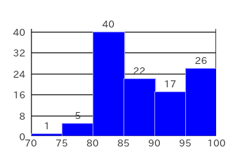
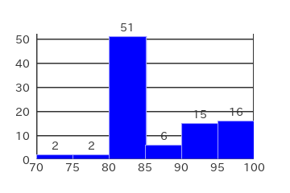
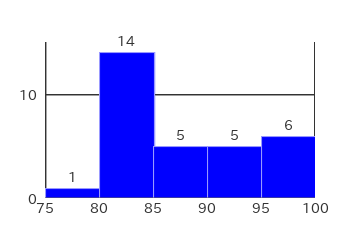
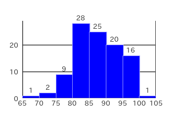
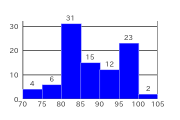
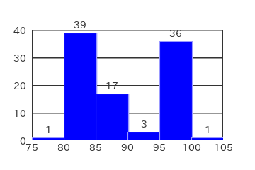
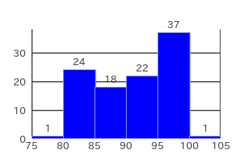
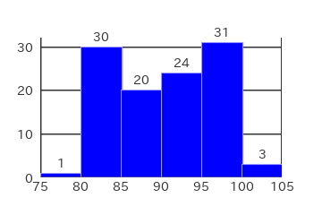

# Pitching speed (MPH)

## Pitcher:

[Ohtani Shohei](https://www.mlb.com/player/shohei-ohtani-660271)

## Data Source

[savant](https://baseballsavant.mlb.com/)

## Dates

- [2023-03-30](#2023-03-30)
- [2023-04-05](#2023-04-05)
- [2023-04-11](#2023-04-11)
- [2023-04-17](#2023-04-17)
- [2023-04-21](#2023-04-21)
- [2023-04-27](#2023-04-27)
- [2023-05-03](#2023-05-03)
- [2023-05-09](#2023-05-09)
- [2023-05-15](#2023-05-15)
- [2023-05-21](#2023-05-21)
- [2023-05-27](#2023-05-27)

## 2023-03-30

Properties

|Property|Value|
|:---|---:|
|ClassRange|5|
|Max|100|
|Min|76|
|DataRange|24|
|Mode|82.5|
|Mean|89.1|
|Median|86|
|FirstQuartile|83.5|
|ThirdQuartile|96.5|
|InterQuartileRange|13|
|QuartileDeviation|6.5|

Frequency Table

|Class|Frequency|RelativeFrequency|ClassValue|ClassValue * Frequency|
|:---:|:---:|:---:|:---:|---:|
|75 ~ 80|2|0.02|77.5|155.0|
|80 ~ 85|33|0.35|82.5|2,722.5|
|85 ~ 90|23|0.25|87.5|2,012.5|
|90 ~ 95|5|0.05|92.5|462.5|
|95 ~ 100|29|0.31|97.5|2,827.5|
|100 ~ 105|1|0.01|102.5|102.5|
|Total|93|1.00|---|8,282.5|
|Mean|---|---|---|89.1|

## 2023-04-05

Properties

|Property|Value|
|:---|---:|
|ClassRange|5|
|Max|98|
|Min|74|
|DataRange|24|
|Mode|82.5|
|Mean|88.2|
|Median|86|
|FirstQuartile|83|
|ThirdQuartile|94|
|InterQuartileRange|11|
|QuartileDeviation|5.5|

Frequency Table

|Class|Frequency|RelativeFrequency|ClassValue|ClassValue * Frequency|
|:---:|:---:|:---:|:---:|---:|
|70 ~ 75|1|0.01|72.5|72.5|
|75 ~ 80|5|0.05|77.5|387.5|
|80 ~ 85|40|0.36|82.5|3,300.0|
|85 ~ 90|22|0.20|87.5|1,925.0|
|90 ~ 95|17|0.15|92.5|1,572.5|
|95 ~ 100|26|0.23|97.5|2,535.0|
|Total|111|1.00|---|9,792.5|
|Mean|---|---|---|88.2|

## 2023-04-11

Properties

|Property|Value|
|:---|---:|
|ClassRange|5|
|Max|98|
|Min|73|
|DataRange|25|
|Mode|82.5|
|Mean|86.7|
|Median|83|
|FirstQuartile|82|
|ThirdQuartile|93|
|InterQuartileRange|11|
|QuartileDeviation|5.5|

Frequency Table

|Class|Frequency|RelativeFrequency|ClassValue|ClassValue * Frequency|
|:---:|:---:|:---:|:---:|---:|
|70 ~ 75|2|0.02|72.5|145.0|
|75 ~ 80|2|0.02|77.5|155.0|
|80 ~ 85|51|0.55|82.5|4,207.5|
|85 ~ 90|6|0.07|87.5|525.0|
|90 ~ 95|15|0.16|92.5|1,387.5|
|95 ~ 100|16|0.17|97.5|1,560.0|
|Total|92|1.00|---|7,980.0|
|Mean|---|---|---|86.7|

## 2023-04-17

Properties

|Property|Value|
|:---|---:|
|ClassRange|5|
|Max|98|
|Min|78|
|DataRange|20|
|Mode|82.5|
|Mean|87.7|
|Median|85|
|FirstQuartile|82|
|ThirdQuartile|91|
|InterQuartileRange|9|
|QuartileDeviation|4.5|

Frequency Table

|Class|Frequency|RelativeFrequency|ClassValue|ClassValue * Frequency|
|:---:|:---:|:---:|:---:|---:|
|75 ~ 80|1|0.03|77.5|77.5|
|80 ~ 85|14|0.45|82.5|1,155.0|
|85 ~ 90|5|0.16|87.5|437.5|
|90 ~ 95|5|0.16|92.5|462.5|
|95 ~ 100|6|0.19|97.5|585.0|
|Total|31|1.00|---|2,717.5|
|Mean|---|---|---|87.7|

## 2023-04-21

Properties

|Property|Value|
|:---|---:|
|ClassRange|5|
|Max|100|
|Min|68|
|DataRange|32|
|Mode|82.5|
|Mean|87.5|
|Median|86.5|
|FirstQuartile|83|
|ThirdQuartile|91|
|InterQuartileRange|8|
|QuartileDeviation|4|

Frequency Table

|Class|Frequency|RelativeFrequency|ClassValue|ClassValue * Frequency|
|:---:|:---:|:---:|:---:|---:|
|65 ~ 70|1|0.01|67.5|67.5|
|70 ~ 75|2|0.02|72.5|145.0|
|75 ~ 80|9|0.09|77.5|697.5|
|80 ~ 85|28|0.27|82.5|2,310.0|
|85 ~ 90|25|0.25|87.5|2,187.5|
|90 ~ 95|20|0.20|92.5|1,850.0|
|95 ~ 100|16|0.16|97.5|1,560.0|
|100 ~ 105|1|0.01|102.5|102.5|
|Total|102|1.00|---|8,920.0|
|Mean|---|---|---|87.5|

## 2023-04-27

Properties

|Property|Value|
|:---|---:|
|ClassRange|5|
|Max|101|
|Min|70|
|DataRange|31|
|Mode|82.5|
|Mean|88.0|
|Median|87|
|FirstQuartile|82|
|ThirdQuartile|95|
|InterQuartileRange|13|
|QuartileDeviation|6.5|

Frequency Table

|Class|Frequency|RelativeFrequency|ClassValue|ClassValue * Frequency|
|:---:|:---:|:---:|:---:|---:|
|70 ~ 75|4|0.04|72.5|290.0|
|75 ~ 80|6|0.06|77.5|465.0|
|80 ~ 85|31|0.33|82.5|2,557.5|
|85 ~ 90|15|0.16|87.5|1,312.5|
|90 ~ 95|12|0.13|92.5|1,110.0|
|95 ~ 100|23|0.25|97.5|2,242.5|
|100 ~ 105|2|0.02|102.5|205.0|
|Total|93|1.00|---|8,182.5|
|Mean|---|---|---|88.0|

## 2023-05-03

Properties

|Property|Value|
|:---|---:|
|ClassRange|5|
|Max|100|
|Min|75|
|DataRange|25|
|Mode|82.5|
|Mean|89.4|
|Median|86|
|FirstQuartile|84|
|ThirdQuartile|97|
|InterQuartileRange|13|
|QuartileDeviation|6.5|

Frequency Table

|Class|Frequency|RelativeFrequency|ClassValue|ClassValue * Frequency|
|:---:|:---:|:---:|:---:|---:|
|75 ~ 80|1|0.01|77.5|77.5|
|80 ~ 85|39|0.40|82.5|3,217.5|
|85 ~ 90|17|0.18|87.5|1,487.5|
|90 ~ 95|3|0.03|92.5|277.5|
|95 ~ 100|36|0.37|97.5|3,510.0|
|100 ~ 105|1|0.01|102.5|102.5|
|Total|97|1.00|---|8,672.5|
|Mean|---|---|---|89.4|

## 2023-05-09

Properties

|Property|Value|
|:---|---:|
|ClassRange|5|
|Max|100|
|Min|76|
|DataRange|24|
|Mode|97.5|
|Mean|91.0|
|Median|93|
|FirstQuartile|85|
|ThirdQuartile|95|
|InterQuartileRange|10|
|QuartileDeviation|5|

Frequency Table

|Class|Frequency|RelativeFrequency|ClassValue|ClassValue * Frequency|
|:---:|:---:|:---:|:---:|---:|
|75 ~ 80|1|0.01|77.5|77.5|
|80 ~ 85|24|0.23|82.5|1,980.0|
|85 ~ 90|18|0.17|87.5|1,575.0|
|90 ~ 95|22|0.21|92.5|2,035.0|
|95 ~ 100|37|0.36|97.5|3,607.5|
|100 ~ 105|1|0.01|102.5|102.5|
|Total|103|1.00|---|9,377.5|
|Mean|---|---|---|91.0|

## 2023-05-15

Properties

|Property|Value|
|:---|---:|
|ClassRange|5|
|Max|99|
|Min|77|
|DataRange|22|
|Mode|87.5|
|Mean|90.2|
|Median|89|
|FirstQuartile|86|
|ThirdQuartile|95|
|InterQuartileRange|9|
|QuartileDeviation|4.5|

Frequency Table

|Class|Frequency|RelativeFrequency|ClassValue|ClassValue * Frequency|
|:---:|:---:|:---:|:---:|---:|
|75 ~ 80|2|0.02|77.5|155.0|
|80 ~ 85|15|0.15|82.5|1,237.5|
|85 ~ 90|34|0.35|87.5|2,975.0|
|90 ~ 95|22|0.22|92.5|2,035.0|
|95 ~ 100|25|0.26|97.5|2,437.5|
|Total|98|1.00|---|8,840.0|
|Mean|---|---|---|90.2|

## 2023-05-21

Properties

|Property|Value|
|:---|---:|
|ClassRange|5|
|Max|99|
|Min|79|
|DataRange|20|
|Mode|82.5|
|Mean|89.9|
|Median|90|
|FirstQuartile|84|
|ThirdQuartile|95|
|InterQuartileRange|11|
|QuartileDeviation|5.5|

Frequency Table

|Class|Frequency|RelativeFrequency|ClassValue|ClassValue * Frequency|
|:---:|:---:|:---:|:---:|---:|
|75 ~ 80|1|0.01|77.5|77.5|
|80 ~ 85|27|0.27|82.5|2,227.5|
|85 ~ 90|19|0.19|87.5|1,662.5|
|90 ~ 95|27|0.27|92.5|2,497.5|
|95 ~ 100|25|0.25|97.5|2,437.5|
|Total|99|1.00|---|8,902.5|
|Mean|---|---|---|89.9|

## 2023-05-27

Properties

|Property|Value|
|:---|---:|
|ClassRange|5|
|Max|101|
|Min|79|
|DataRange|22|
|Mode|97.5|
|Mean|90.4|
|Median|91|
|FirstQuartile|84|
|ThirdQuartile|96|
|InterQuartileRange|12|
|QuartileDeviation|6|

Frequency Table

|Class|Frequency|RelativeFrequency|ClassValue|ClassValue * Frequency|
|:---:|:---:|:---:|:---:|---:|
|75 ~ 80|1|0.01|77.5|77.5|
|80 ~ 85|30|0.28|82.5|2,475.0|
|85 ~ 90|20|0.18|87.5|1,750.0|
|90 ~ 95|24|0.22|92.5|2,220.0|
|95 ~ 100|31|0.28|97.5|3,022.5|
|100 ~ 105|3|0.03|102.5|307.5|
|Total|109|1.00|---|9,852.5|
|Mean|---|---|---|90.4|

