# Pitching speed (MPH)

## Pitcher:

[Ohtani Shohei](https://www.mlb.com/player/shohei-ohtani-660271)

## Data Source

[savant](https://baseballsavant.mlb.com/)

## Dates

- [2025-06-16](#2025-06-16)
- [2025-06-22](#2025-06-22)
- [2025-06-28](#2025-06-28)
- [2025-07-05](#2025-07-05)
- [2025-07-12](#2025-07-12)
- [2025-07-21](#2025-07-21)
- [2025-07-30](#2025-07-30)
- [2025-08-06](#2025-08-06)
- [2025-08-13](#2025-08-13)
- [2025-08-20](#2025-08-20)
- [2025-08-27](#2025-08-27)
- [2025-09-05](#2025-09-05)
- [2025-09-16](#2025-09-16)
- [2025-09-23](#2025-09-23)
- [2026-03-31](#2026-03-31)

## 2025-06-16

Properties

|Property|Value|
|:---|---:|
|ClassRange|5|
|Max|100|
|Min|83|
|DataRange|17|
|Mode|97.5|
|Mean|93.6|
|Median|97|
|FirstQuartile|87.5|
|ThirdQuartile|98|
|InterQuartileRange|10.5|
|QuartileDeviation|5.25|

Frequency Table

|Class|Frequency|RelativeFrequency|ClassValue|ClassValue * Frequency|
|:---:|:---:|:---:|:---:|---:|
|80 ~ 85|2|0.07|82.5|165.0|
|85 ~ 90|8|0.29|87.5|700.0|
|90 ~ 95|1|0.04|92.5|92.5|
|95 ~ 100|16|0.57|97.5|1,560.0|
|100 ~ 105|1|0.04|102.5|102.5|
|Total|28|1.00|---|2,620.0|
|Mean|---|---|---|93.6|

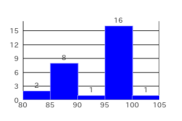

## 2025-06-22

Properties

|Property|Value|
|:---|---:|
|ClassRange|5|
|Max|98|
|Min|82|
|DataRange|16|
|Mode|97.5|
|Mean|90.6|
|Median|91|
|FirstQuartile|84|
|ThirdQuartile|97|
|InterQuartileRange|13|
|QuartileDeviation|6.5|

Frequency Table

|Class|Frequency|RelativeFrequency|ClassValue|ClassValue * Frequency|
|:---:|:---:|:---:|:---:|---:|
|80 ~ 85|5|0.28|82.5|412.5|
|85 ~ 90|3|0.17|87.5|262.5|
|90 ~ 95|4|0.22|92.5|370.0|
|95 ~ 100|6|0.33|97.5|585.0|
|Total|18|1.00|---|1,630.0|
|Mean|---|---|---|90.6|

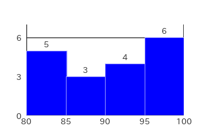

## 2025-06-28

Properties

|Property|Value|
|:---|---:|
|ClassRange|5|
|Max|101|
|Min|81|
|DataRange|20|
|Mode|82.5|
|Mean|91.0|
|Median|91|
|FirstQuartile|84|
|ThirdQuartile|98|
|InterQuartileRange|14|
|QuartileDeviation|7|

Frequency Table

|Class|Frequency|RelativeFrequency|ClassValue|ClassValue * Frequency|
|:---:|:---:|:---:|:---:|---:|
|80 ~ 85|9|0.33|82.5|742.5|
|85 ~ 90|4|0.15|87.5|350.0|
|90 ~ 95|3|0.11|92.5|277.5|
|95 ~ 100|8|0.30|97.5|780.0|
|100 ~ 105|3|0.11|102.5|307.5|
|Total|27|1.00|---|2,457.5|
|Mean|---|---|---|91.0|

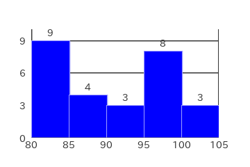

## 2025-07-05

Properties

|Property|Value|
|:---|---:|
|ClassRange|5|
|Max|100|
|Min|80|
|DataRange|20|
|Mode|97.5|
|Mean|92.0|
|Median|94|
|FirstQuartile|86|
|ThirdQuartile|97|
|InterQuartileRange|11|
|QuartileDeviation|5.5|

Frequency Table

|Class|Frequency|RelativeFrequency|ClassValue|ClassValue * Frequency|
|:---:|:---:|:---:|:---:|---:|
|80 ~ 85|5|0.16|82.5|412.5|
|85 ~ 90|9|0.29|87.5|787.5|
|90 ~ 95|2|0.06|92.5|185.0|
|95 ~ 100|14|0.45|97.5|1,365.0|
|100 ~ 105|1|0.03|102.5|102.5|
|Total|31|1.00|---|2,852.5|
|Mean|---|---|---|92.0|

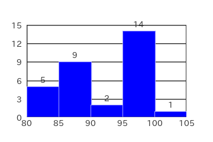

## 2025-07-12

Properties

|Property|Value|
|:---|---:|
|ClassRange|5|
|Max|99|
|Min|82|
|DataRange|17|
|Mode|97.5|
|Mean|94.0|
|Median|97|
|FirstQuartile|92|
|ThirdQuartile|98|
|InterQuartileRange|6|
|QuartileDeviation|3|

Frequency Table

|Class|Frequency|RelativeFrequency|ClassValue|ClassValue * Frequency|
|:---:|:---:|:---:|:---:|---:|
|80 ~ 85|5|0.14|82.5|412.5|
|85 ~ 90|3|0.08|87.5|262.5|
|90 ~ 95|4|0.11|92.5|370.0|
|95 ~ 100|24|0.67|97.5|2,340.0|
|Total|36|1.00|---|3,385.0|
|Mean|---|---|---|94.0|

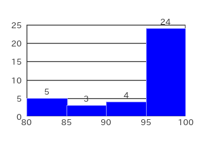

## 2025-07-21

Properties

|Property|Value|
|:---|---:|
|ClassRange|5|
|Max|99|
|Min|83|
|DataRange|16|
|Mode|97.5|
|Mean|93.5|
|Median|96|
|FirstQuartile|87|
|ThirdQuartile|97|
|InterQuartileRange|10|
|QuartileDeviation|5|

Frequency Table

|Class|Frequency|RelativeFrequency|ClassValue|ClassValue * Frequency|
|:---:|:---:|:---:|:---:|---:|
|80 ~ 85|4|0.09|82.5|330.0|
|85 ~ 90|8|0.17|87.5|700.0|
|90 ~ 95|9|0.20|92.5|832.5|
|95 ~ 100|25|0.54|97.5|2,437.5|
|Total|46|1.00|---|4,300.0|
|Mean|---|---|---|93.5|

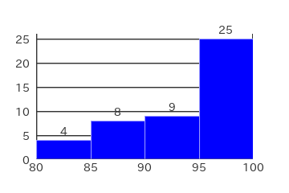

## 2025-07-30

Properties

|Property|Value|
|:---|---:|
|ClassRange|5|
|Max|101|
|Min|82|
|DataRange|19|
|Mode|97.5|
|Mean|90.2|
|Median|86|
|FirstQuartile|84|
|ThirdQuartile|97|
|InterQuartileRange|13|
|QuartileDeviation|6.5|

Frequency Table

|Class|Frequency|RelativeFrequency|ClassValue|ClassValue * Frequency|
|:---:|:---:|:---:|:---:|---:|
|80 ~ 85|14|0.27|82.5|1,155.0|
|85 ~ 90|16|0.31|87.5|1,400.0|
|90 ~ 95|2|0.04|92.5|185.0|
|95 ~ 100|17|0.33|97.5|1,657.5|
|100 ~ 105|2|0.04|102.5|205.0|
|Total|51|1.00|---|4,602.5|
|Mean|---|---|---|90.2|

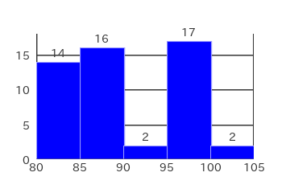

## 2025-08-06

Properties

|Property|Value|
|:---|---:|
|ClassRange|5|
|Max|101|
|Min|76|
|DataRange|25|
|Mode|97.5|
|Mean|93.3|
|Median|97|
|FirstQuartile|88|
|ThirdQuartile|99|
|InterQuartileRange|11|
|QuartileDeviation|5.5|

Frequency Table

|Class|Frequency|RelativeFrequency|ClassValue|ClassValue * Frequency|
|:---:|:---:|:---:|:---:|---:|
|75 ~ 80|3|0.06|77.5|232.5|
|80 ~ 85|6|0.11|82.5|495.0|
|85 ~ 90|9|0.17|87.5|787.5|
|90 ~ 95|3|0.06|92.5|277.5|
|95 ~ 100|27|0.50|97.5|2,632.5|
|100 ~ 105|6|0.11|102.5|615.0|
|Total|54|1.00|---|5,040.0|
|Mean|---|---|---|93.3|

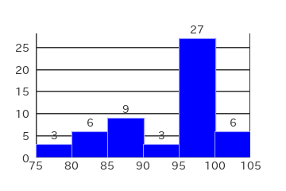

## 2025-08-13

Properties

|Property|Value|
|:---|---:|
|ClassRange|5|
|Max|100|
|Min|72|
|DataRange|28|
|Mode|97.5|
|Mean|91.4|
|Median|91.5|
|FirstQuartile|85|
|ThirdQuartile|98|
|InterQuartileRange|13|
|QuartileDeviation|6.5|

Frequency Table

|Class|Frequency|RelativeFrequency|ClassValue|ClassValue * Frequency|
|:---:|:---:|:---:|:---:|---:|
|70 ~ 75|2|0.03|72.5|145.0|
|75 ~ 80|1|0.01|77.5|77.5|
|80 ~ 85|13|0.16|82.5|1,072.5|
|85 ~ 90|22|0.28|87.5|1,925.0|
|90 ~ 95|4|0.05|92.5|370.0|
|95 ~ 100|35|0.44|97.5|3,412.5|
|100 ~ 105|3|0.04|102.5|307.5|
|Total|80|1.00|---|7,310.0|
|Mean|---|---|---|91.4|

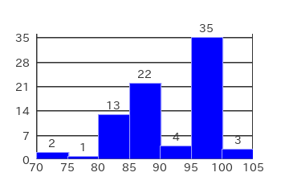

## 2025-08-20

Properties

|Property|Value|
|:---|---:|
|ClassRange|5|
|Max|99|
|Min|73|
|DataRange|26|
|Mode|87.5|
|Mean|88.9|
|Median|88|
|FirstQuartile|85|
|ThirdQuartile|94|
|InterQuartileRange|9|
|QuartileDeviation|4.5|

Frequency Table

|Class|Frequency|RelativeFrequency|ClassValue|ClassValue * Frequency|
|:---:|:---:|:---:|:---:|---:|
|70 ~ 75|3|0.05|72.5|217.5|
|75 ~ 80|2|0.03|77.5|155.0|
|80 ~ 85|10|0.15|82.5|825.0|
|85 ~ 90|25|0.38|87.5|2,187.5|
|90 ~ 95|11|0.17|92.5|1,017.5|
|95 ~ 100|15|0.23|97.5|1,462.5|
|Total|66|1.00|---|5,865.0|
|Mean|---|---|---|88.9|

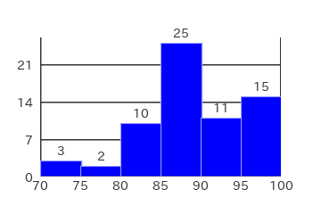

## 2025-08-27

Properties

|Property|Value|
|:---|---:|
|ClassRange|5|
|Max|100|
|Min|74|
|DataRange|26|
|Mode|87.5|
|Mean|88.9|
|Median|89|
|FirstQuartile|82|
|ThirdQuartile|95|
|InterQuartileRange|13|
|QuartileDeviation|6.5|

Frequency Table

|Class|Frequency|RelativeFrequency|ClassValue|ClassValue * Frequency|
|:---:|:---:|:---:|:---:|---:|
|70 ~ 75|1|0.01|72.5|72.5|
|75 ~ 80|12|0.14|77.5|930.0|
|80 ~ 85|14|0.16|82.5|1,155.0|
|85 ~ 90|21|0.24|87.5|1,837.5|
|90 ~ 95|17|0.20|92.5|1,572.5|
|95 ~ 100|18|0.21|97.5|1,755.0|
|100 ~ 105|4|0.05|102.5|410.0|
|Total|87|1.00|---|7,732.5|
|Mean|---|---|---|88.9|

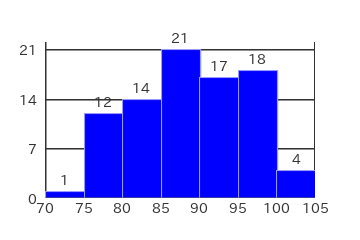

## 2025-09-05

Properties

|Property|Value|
|:---|---:|
|ClassRange|5|
|Max|101|
|Min|73|
|DataRange|28|
|Mode|92.5|
|Mean|91.3|
|Median|92.5|
|FirstQuartile|85|
|ThirdQuartile|98|
|InterQuartileRange|13|
|QuartileDeviation|6.5|

Frequency Table

|Class|Frequency|RelativeFrequency|ClassValue|ClassValue * Frequency|
|:---:|:---:|:---:|:---:|---:|
|70 ~ 75|1|0.01|72.5|72.5|
|75 ~ 80|7|0.10|77.5|542.5|
|80 ~ 85|7|0.10|82.5|577.5|
|85 ~ 90|14|0.20|87.5|1,225.0|
|90 ~ 95|16|0.23|92.5|1,480.0|
|95 ~ 100|14|0.20|97.5|1,365.0|
|100 ~ 105|11|0.16|102.5|1,127.5|
|Total|70|1.00|---|6,390.0|
|Mean|---|---|---|91.3|

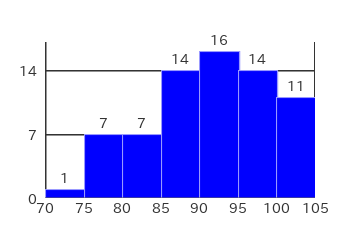

## 2025-09-16

Properties

|Property|Value|
|:---|---:|
|ClassRange|5|
|Max|101|
|Min|72|
|DataRange|29|
|Mode|97.5|
|Mean|93.1|
|Median|96.5|
|FirstQuartile|88|
|ThirdQuartile|99|
|InterQuartileRange|11|
|QuartileDeviation|5.5|

Frequency Table

|Class|Frequency|RelativeFrequency|ClassValue|ClassValue * Frequency|
|:---:|:---:|:---:|:---:|---:|
|70 ~ 75|1|0.01|72.5|72.5|
|75 ~ 80|4|0.06|77.5|310.0|
|80 ~ 85|4|0.06|82.5|330.0|
|85 ~ 90|14|0.21|87.5|1,225.0|
|90 ~ 95|6|0.09|92.5|555.0|
|95 ~ 100|32|0.47|97.5|3,120.0|
|100 ~ 105|7|0.10|102.5|717.5|
|Total|68|1.00|---|6,330.0|
|Mean|---|---|---|93.1|

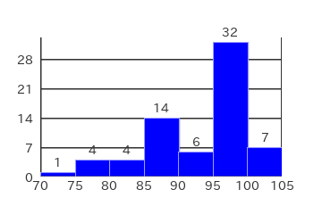

## 2025-09-23

Properties

|Property|Value|
|:---|---:|
|ClassRange|5|
|Max|101|
|Min|73|
|DataRange|28|
|Mode|97.5|
|Mean|91.7|
|Median|94|
|FirstQuartile|86|
|ThirdQuartile|98|
|InterQuartileRange|12|
|QuartileDeviation|6|

Frequency Table

|Class|Frequency|RelativeFrequency|ClassValue|ClassValue * Frequency|
|:---:|:---:|:---:|:---:|---:|
|70 ~ 75|2|0.02|72.5|145.0|
|75 ~ 80|8|0.09|77.5|620.0|
|80 ~ 85|4|0.04|82.5|330.0|
|85 ~ 90|19|0.21|87.5|1,662.5|
|90 ~ 95|14|0.15|92.5|1,295.0|
|95 ~ 100|43|0.47|97.5|4,192.5|
|100 ~ 105|1|0.01|102.5|102.5|
|Total|91|1.00|---|8,347.5|
|Mean|---|---|---|91.7|

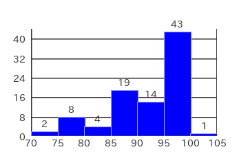

## 2026-03-31

Properties

|Property|Value|
|:---|---:|
|ClassRange|5|
|Max|99|
|Min|69|
|DataRange|30|
|Mode|97.5|
|Mean|87.7|
|Median|87|
|FirstQuartile|82|
|ThirdQuartile|96|
|InterQuartileRange|14|
|QuartileDeviation|7|

Frequency Table

|Class|Frequency|RelativeFrequency|ClassValue|ClassValue * Frequency|
|:---:|:---:|:---:|:---:|---:|
|65 ~ 70|1|0.01|67.5|67.5|
|70 ~ 75|12|0.14|72.5|870.0|
|75 ~ 80|6|0.07|77.5|465.0|
|80 ~ 85|12|0.14|82.5|990.0|
|85 ~ 90|20|0.23|87.5|1,750.0|
|90 ~ 95|4|0.05|92.5|370.0|
|95 ~ 100|32|0.37|97.5|3,120.0|
|Total|87|1.00|---|7,632.5|
|Mean|---|---|---|87.7|

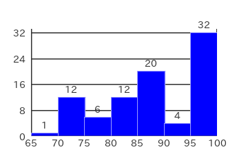

