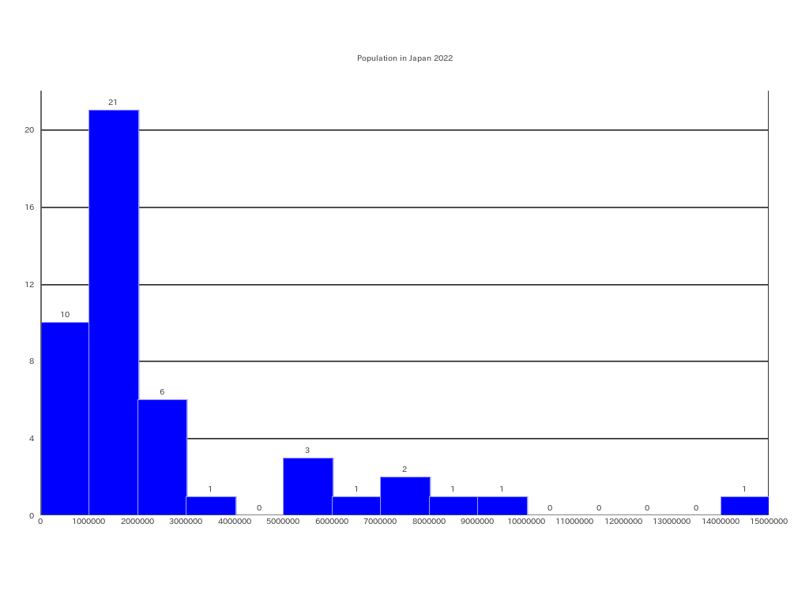

# Population in Japan, in 2022

使用データ(INPUT DATA)：総務省(Ministry of Internal Affairs and Communications)

 

**Population In Japan, in 2022**
 

|Prefecture|Population|
|:---:|---:|
|北海道|5,246,170|
|青森県|1,249,527|
|岩手県|1,227,142|
|宮城県|2,321,203|
|秋田県|970,724|
|山形県|1,070,600|
|福島県|1,842,608|
|茨城県|2,924,544|
|栃木県|1,974,255|
|群馬県|1,987,570|
|埼玉県|7,328,472|
|千葉県|6,296,556|
|東京都|14,042,127|
|神奈川県|9,271,325|
|新潟県|2,150,392|
|富山県|1,064,722|
|石川県|1,157,057|
|福井県|778,444|
|山梨県|850,270|
|長野県|2,094,126|
|岐阜県|1,969,582|
|静岡県|3,763,570|
|愛知県|7,533,419|
|三重県|1,815,420|
|滋賀県|1,440,474|
|京都府|2,609,771|
|大阪府|8,833,907|
|兵庫県|5,515,383|
|奈良県|1,362,000|
|和歌山県|944,407|
|鳥取県|555,491|
|島根県|667,646|
|岡山県|1,917,334|
|広島県|2,808,524|
|山口県|1,360,744|
|徳島県|727,080|
|香川県|974,044|
|愛媛県|1,384,016|
|高知県|682,466|
|福岡県|5,117,171|
|佐賀県|818,112|
|長崎県|1,331,605|
|熊本県|1,745,952|
|大分県|1,162,114|
|宮崎県|1,085,258|
|鹿児島県|1,589,361|
|沖縄県|1,435,479|

 

Frequency Table

|Class|Frequency|CumulativeFrequency|RelativeFrequency|CumulativeRelativeFrequency|ClassValue|ClassValue * Frequency|
|:---:|:---:|:---:|:---:|:---:|:---:|---:|
|0 ~ 1,000,000|10|10|0.21|0.21|500,000.0|5,000,000.0|
|1,000,000 ~ 2,000,000|21|31|0.45|0.66|1,500,000.0|31,500,000.0|
|2,000,000 ~ 3,000,000|6|37|0.13|0.79|2,500,000.0|15,000,000.0|
|3,000,000 ~ 4,000,000|1|38|0.02|0.81|3,500,000.0|3,500,000.0|
|4,000,000 ~ 5,000,000|0|38|0.00|0.81|4,500,000.0|0.0|
|5,000,000 ~ 6,000,000|3|41|0.06|0.87|5,500,000.0|16,500,000.0|
|6,000,000 ~ 7,000,000|1|42|0.02|0.89|6,500,000.0|6,500,000.0|
|7,000,000 ~ 8,000,000|2|44|0.04|0.94|7,500,000.0|15,000,000.0|
|8,000,000 ~ 9,000,000|1|45|0.02|0.96|8,500,000.0|8,500,000.0|
|9,000,000 ~ 10,000,000|1|46|0.02|0.98|9,500,000.0|9,500,000.0|
|10,000,000 ~ 11,000,000|0|46|0.00|0.98|10,500,000.0|0.0|
|11,000,000 ~ 12,000,000|0|46|0.00|0.98|11,500,000.0|0.0|
|12,000,000 ~ 13,000,000|0|46|0.00|0.98|12,500,000.0|0.0|
|13,000,000 ~ 14,000,000|0|46|0.00|0.98|13,500,000.0|0.0|
|14,000,000 ~ 15,000,000|1|47|0.02|1.00|14,500,000.0|14,500,000.0|
|Total|47|47|1.00|1.00|---|125,500,000.0|
|Mean|---|---|---|---|---|2,670,212.8|

## Histogram

